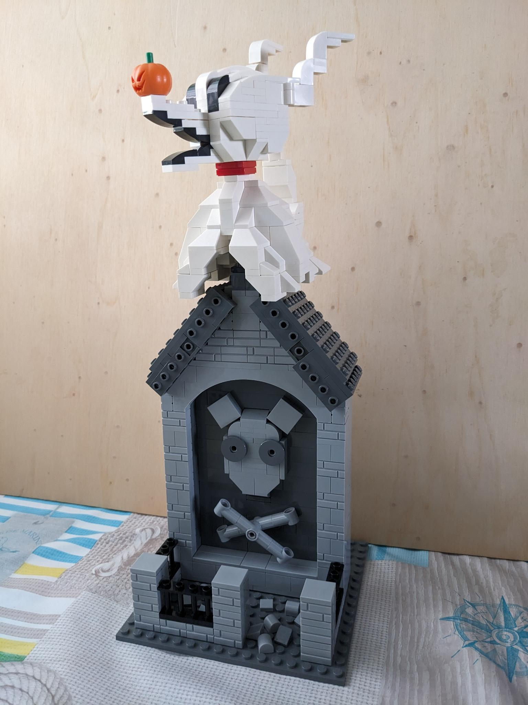
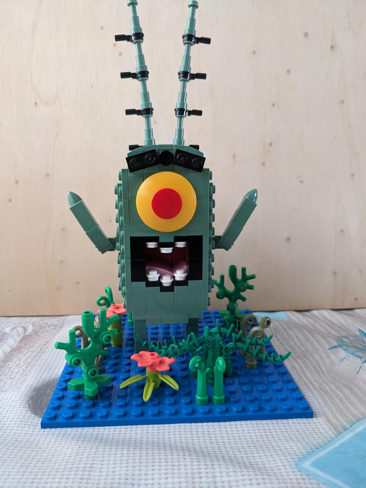
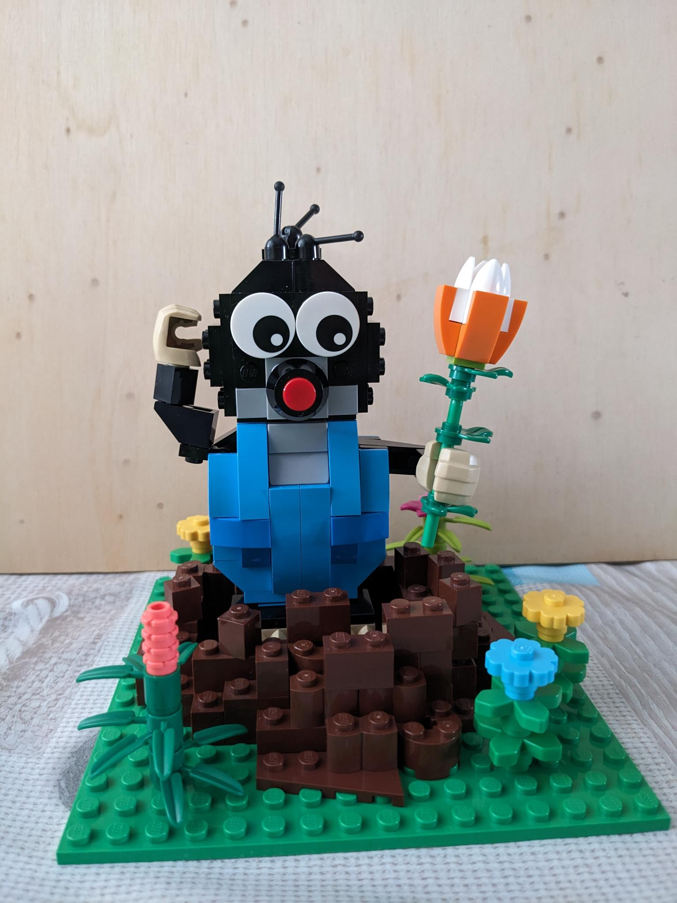
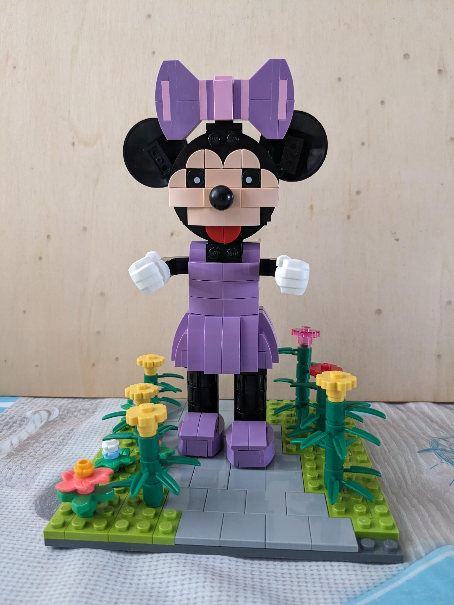
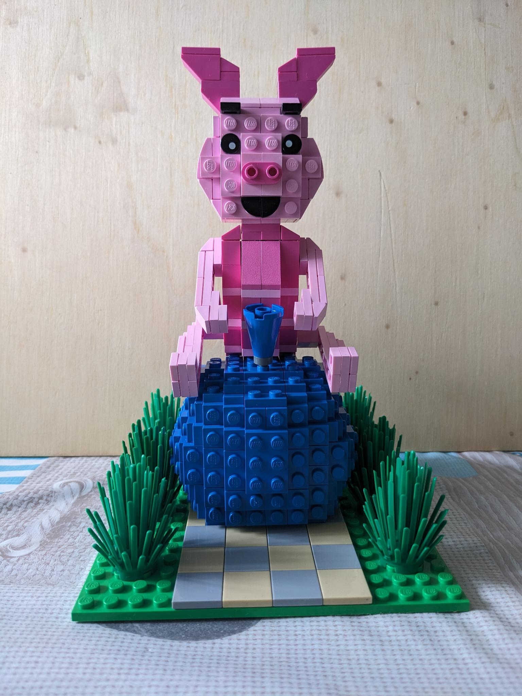
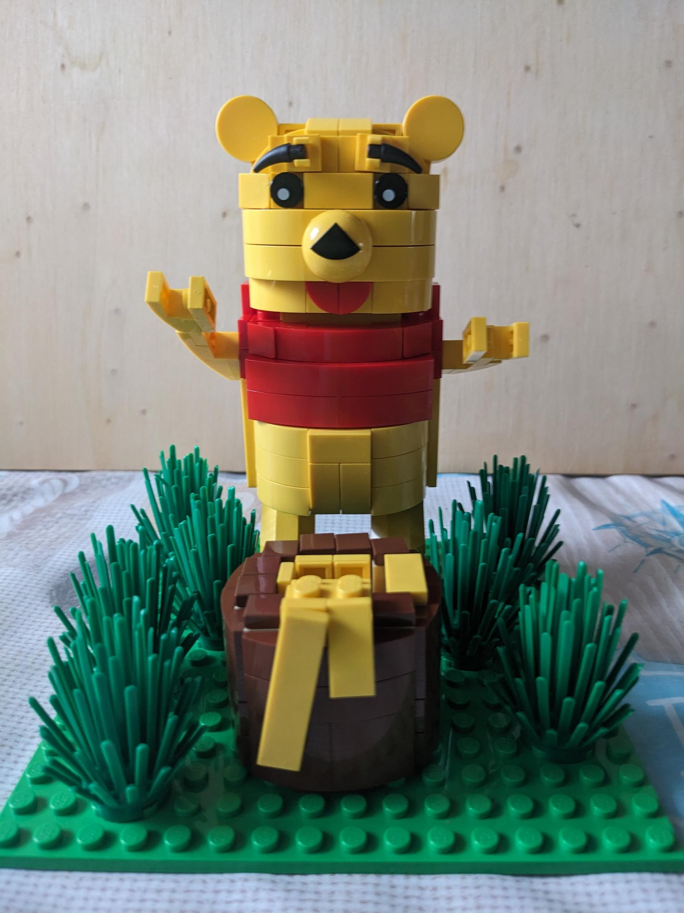
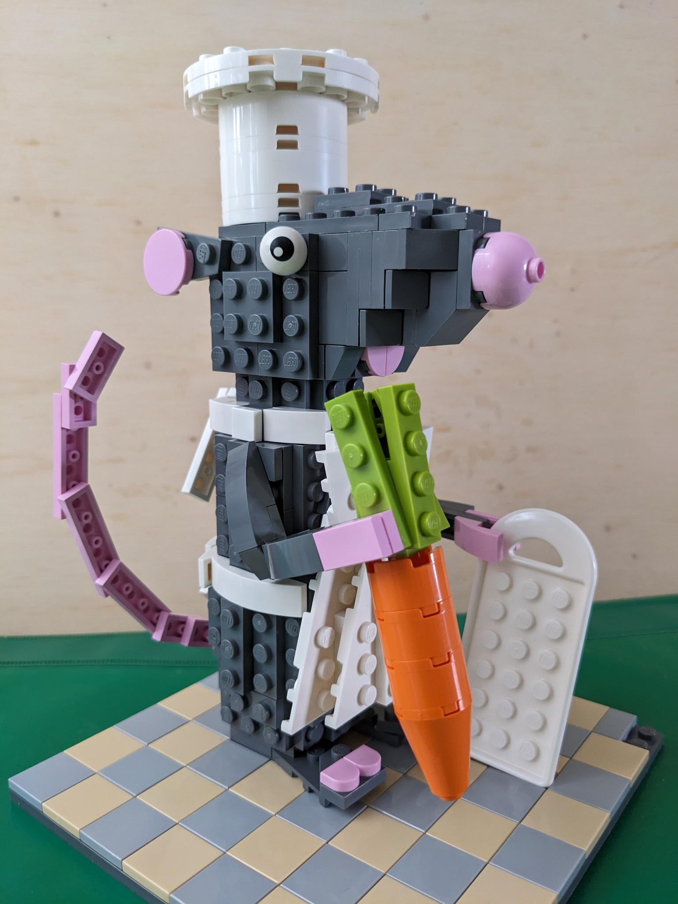
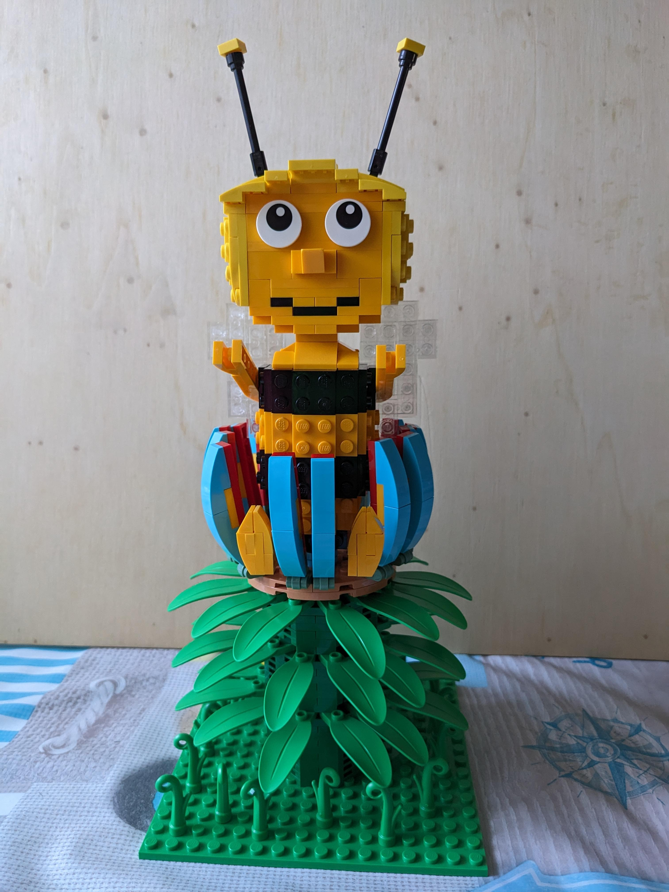
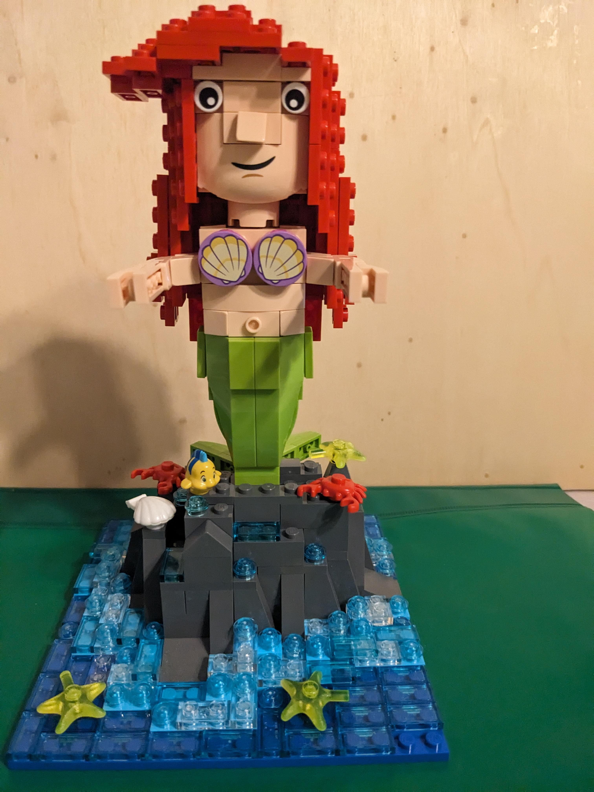

## 1. Rätsel


Zero, aus Nightmare Before Christmas


## 2. Rätsel


Plankton, aus Spongebob Schwammkopf


## 3. Rätsel


Der kleine Maulwurf


## 4. Rätsel


Minnie Maus


## 5. Rätsel


Ferkel, aus Winnie Puuh


## 6. Rätsel


Winnie Puuh


## 7. Rätsel


Ratatouille


## 8. Rätsel


Biene Maja


## 9. Rätsel


Ariel, die Meerjungfrau
