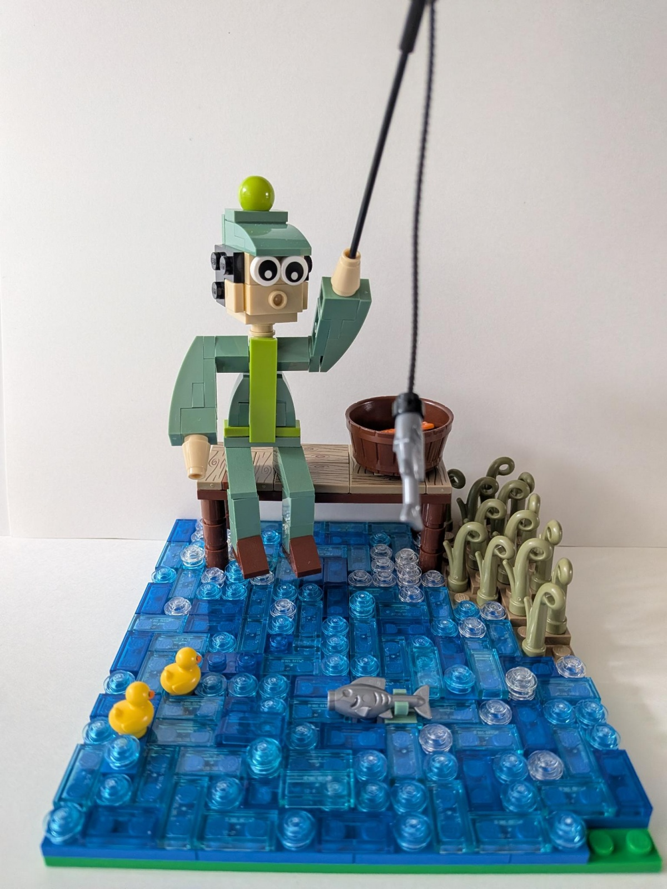
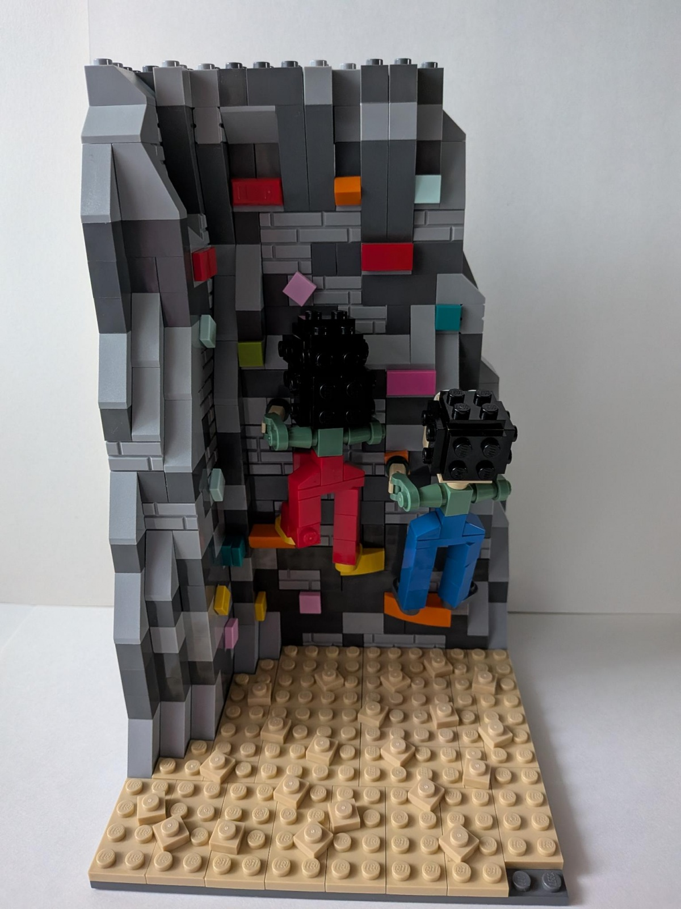
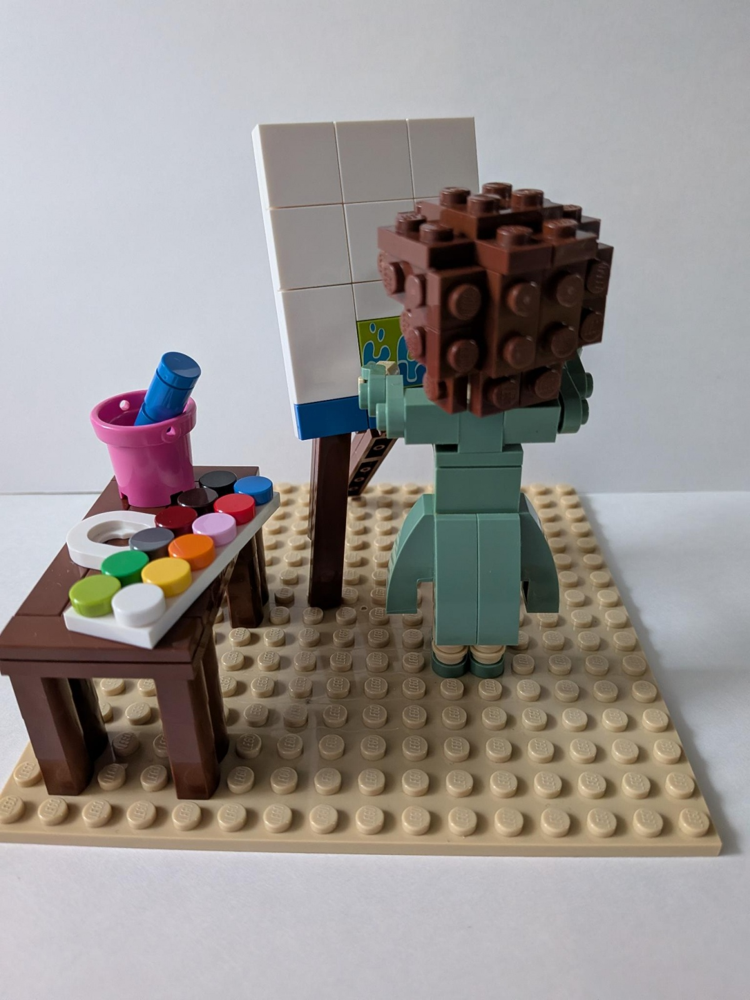
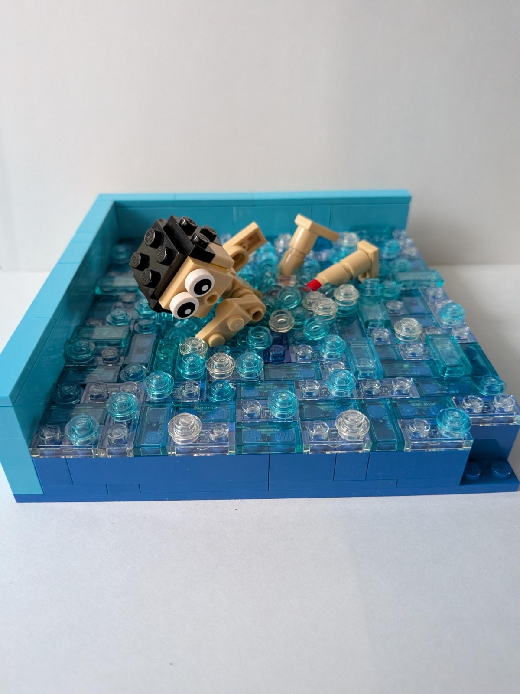
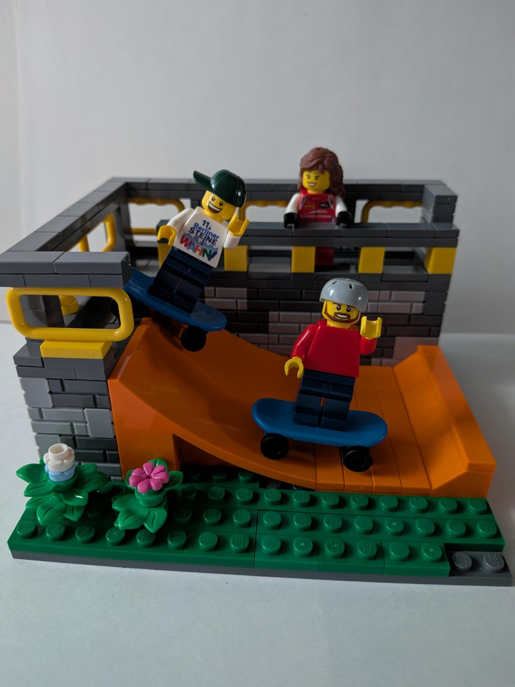
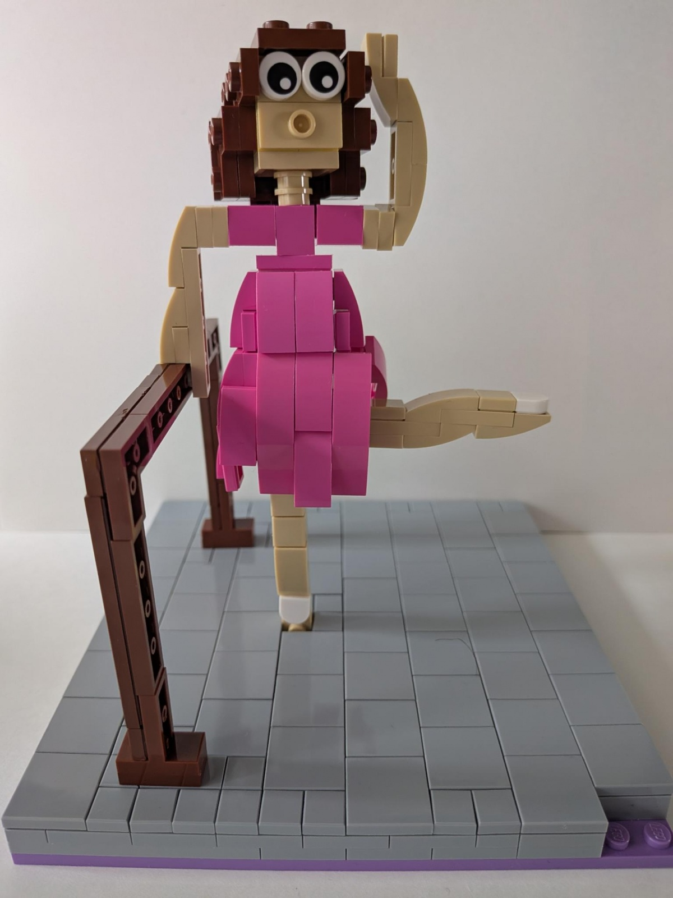

Eine Bauaktion beim 15. Berliner [SteineWAHN!](https://steinewahn.de) hatte das Thema "Freizeit". Es sollten Freizeit-Aktivitäten auf einer 16x16-Platte dargestellt und durch die Besucher erraten werden. Hier sind meine sechs Beiträge zu sehen. Alle weiteren findest du [in dieser Bildergalerie](https://www.1000steine.de/de/gemeinschaft/forum/?entry=1&id=487820).

## 1. Aktivität


Angeln


## 2. Aktivität


Klettern


## 3. Aktivität


Malen


## 4. Aktivität


Schwimmen


## 5. Aktivität


Skateboarden


## 6. Aktivität


Ballett
