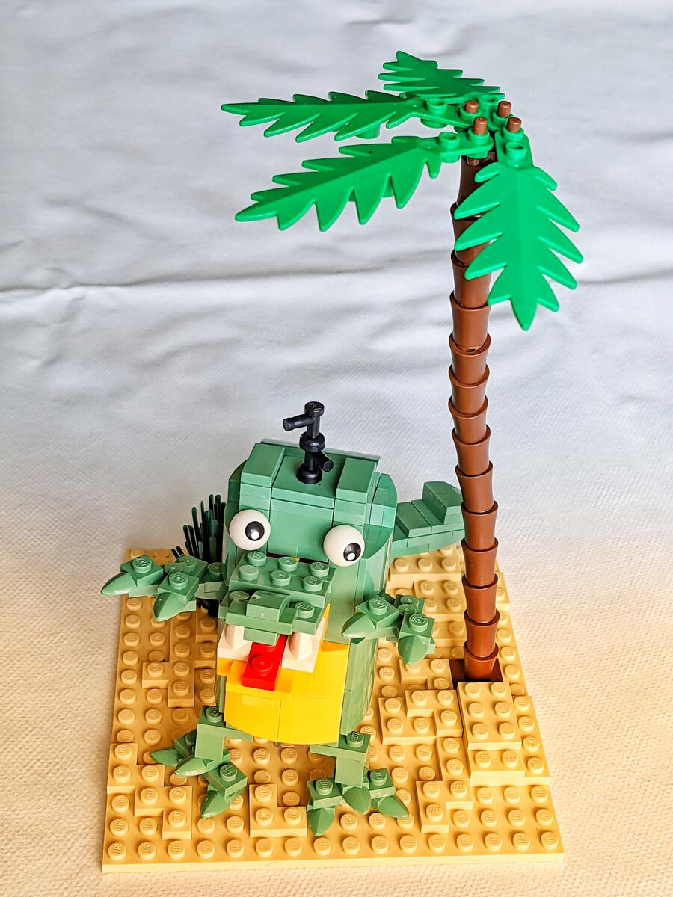
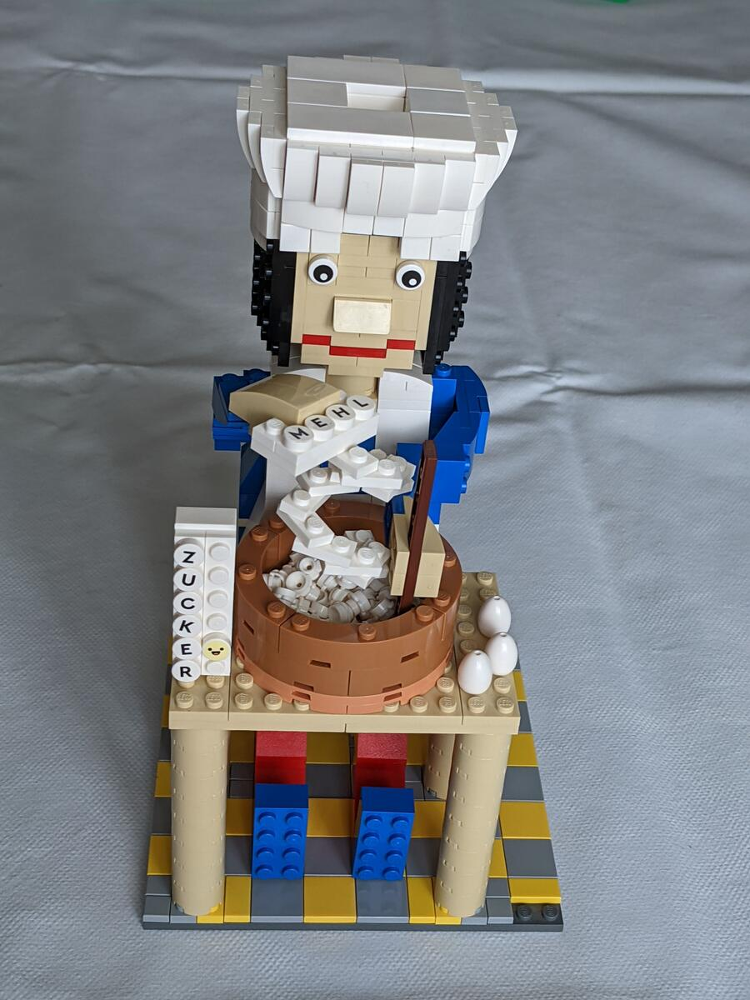
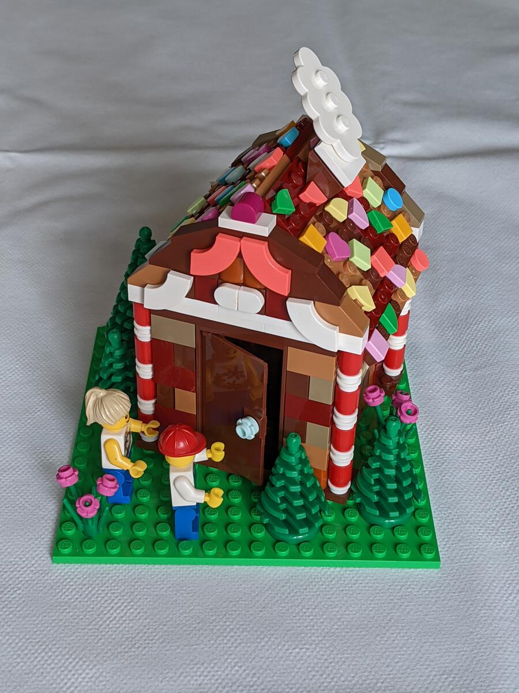
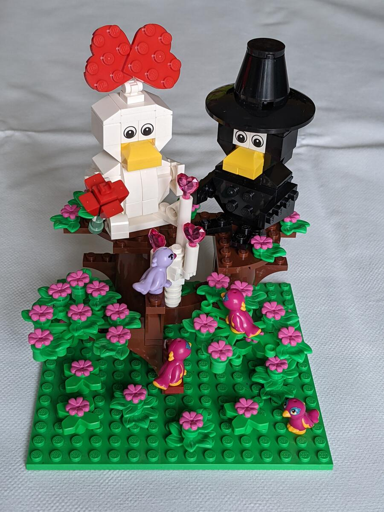
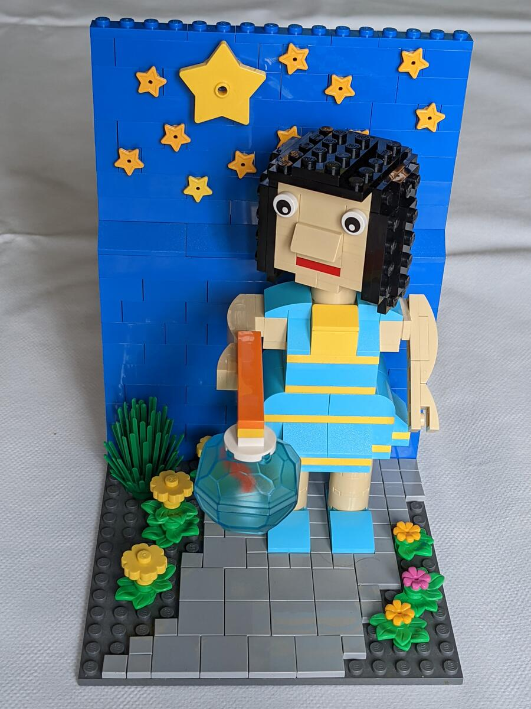
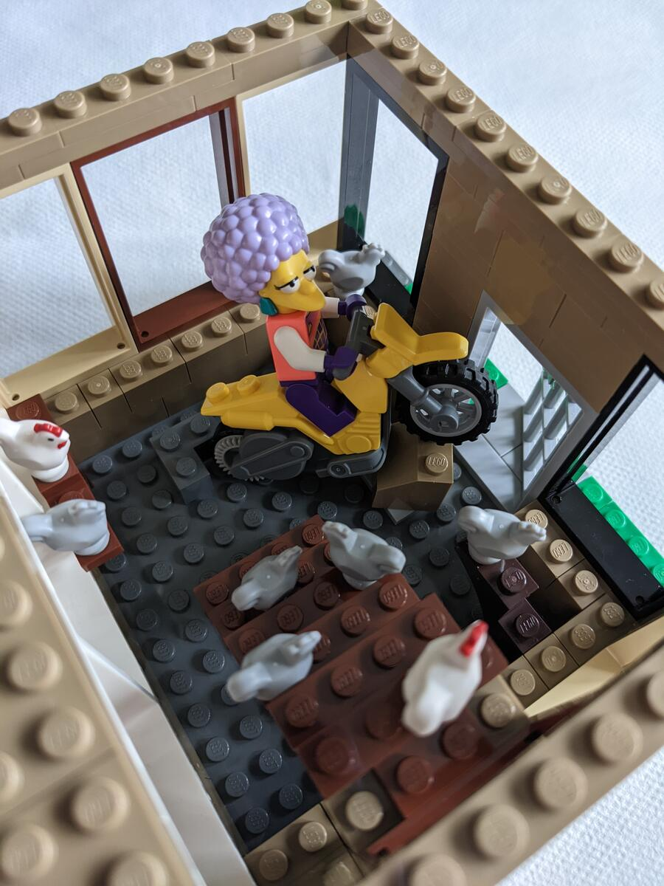
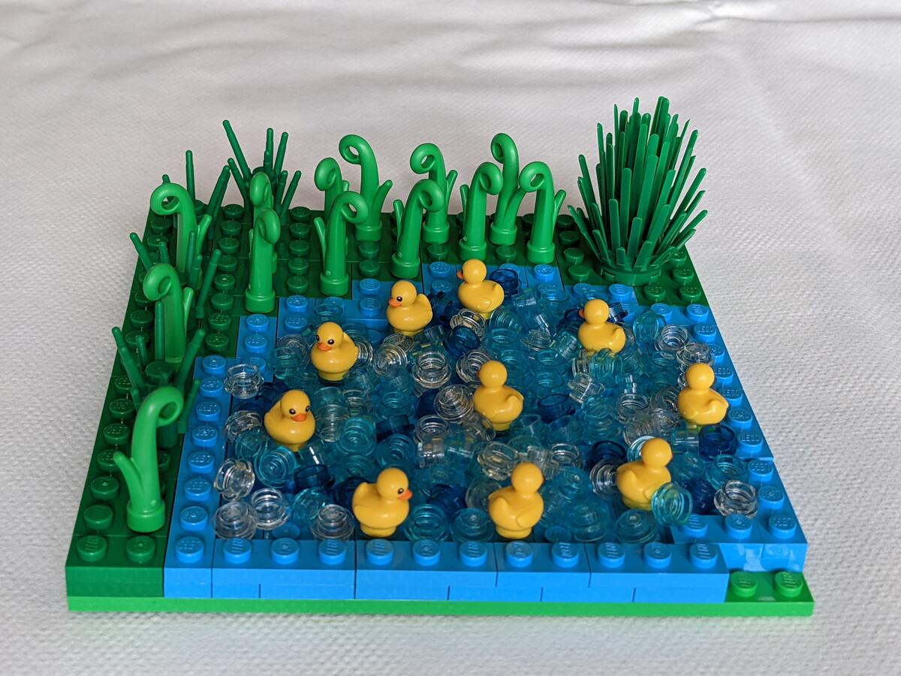
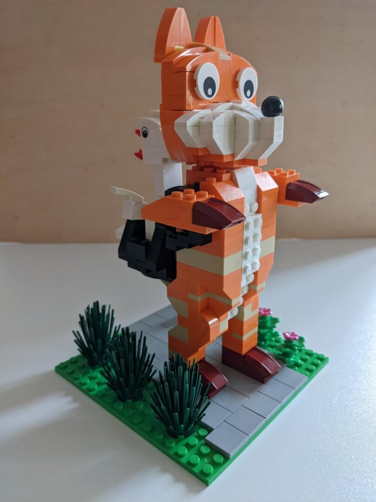
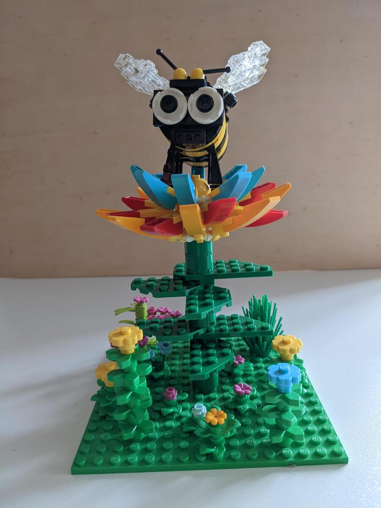

Beim 11. Berliner [SteineWAHN!](https://steinewahn.de) gab es wieder eine gemeinsame Bauaktion. Dieses Mal mussten Kinderlieder auf einer 16x16-Platte dargestellt und durch die Besucher erraten werden. Meine Mutter hat neun Beiträge dafür gebaut - viel Spaß beim Rätseln.

## 1. Rätsel


Schnappi, das kleine Krokodil


## 2. Rätsel


Backe backe Kuchen


## 3. Rätsel


Hänsel und Gretel


## 4. Rätsel


Ein Vogel wollte Hochzeit machen


## 5. Rätsel


Ich gehe mit meiner Laterne


## 6. Rätsel


Meine Oma fährt im Hühnerstall Motorrad


## 7. Rätsel


Alle meine Entchen


## 8. Rätsel


Fuchs, du hast die Gans gestohlen


## 9. Rätsel


Summ summ summ, Bienchen summ herum
