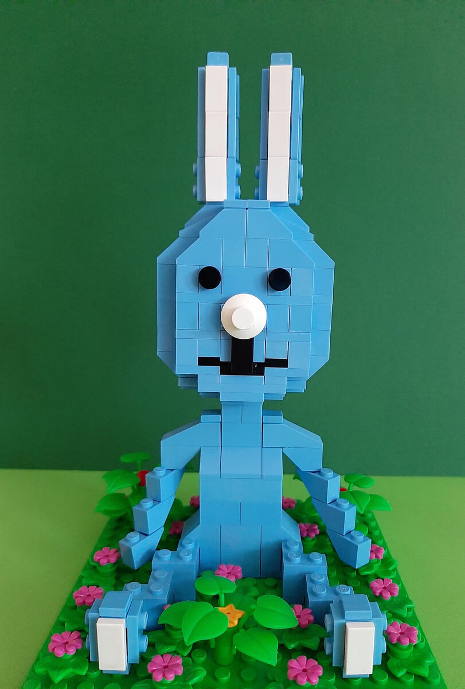
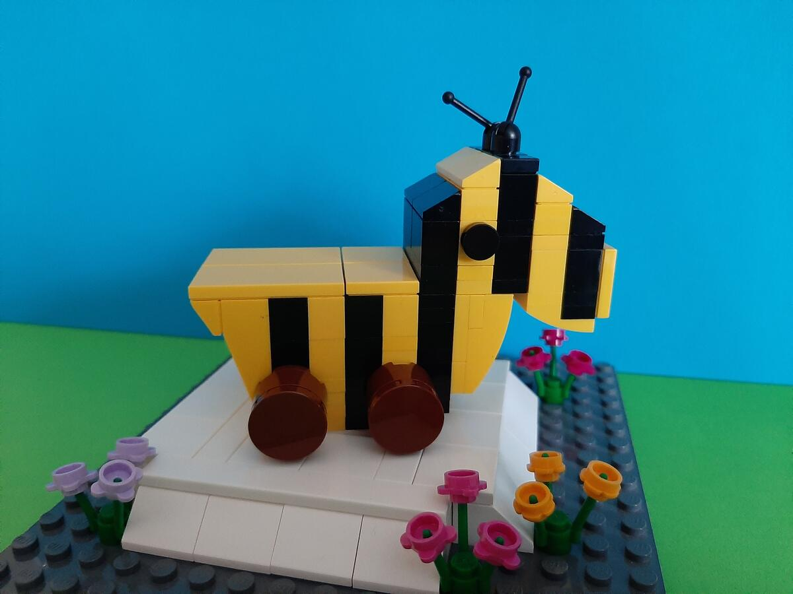
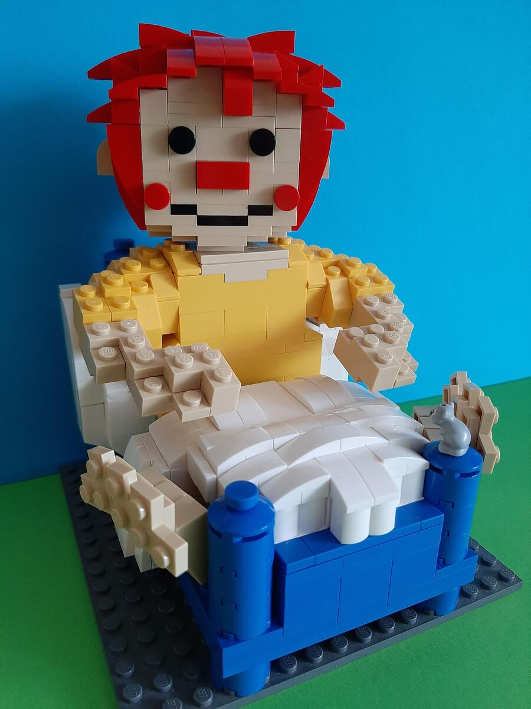
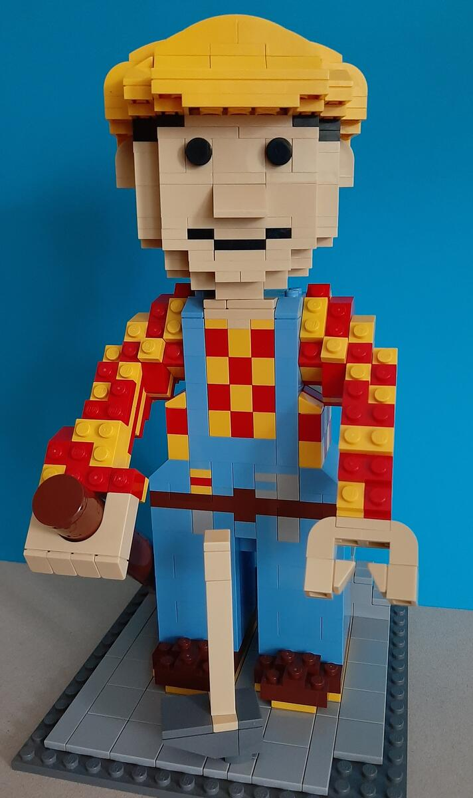
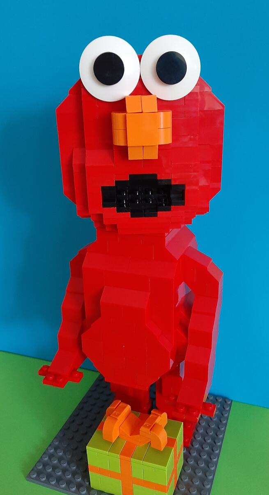
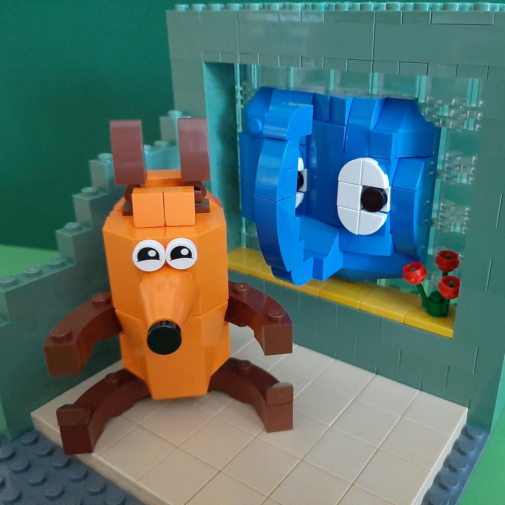
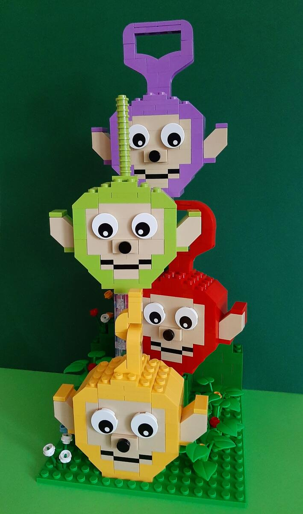

Beim 9. Berliner [SteineWAHN!](https://steinewahn.de) wurden Kinder-TV-Serien zum Erraten für die Besucher gebaut. Meine Mutter hat sieben Beiträge dafür gebaut - viel Spaß beim Rätseln.

## 1. Rätsel


KiKAninchens Welt


## 2. Rätsel


Der Tigerentenclub


## 3. Rätsel


Pumuckl


## 4. Rätsel


Bob der Baumeister


## 5. Rätsel


Die Sesamstraße (Elmo)


## 6. Rätsel


Die Sendung mit der Maus


## 7. Rätsel


Teletubbies
