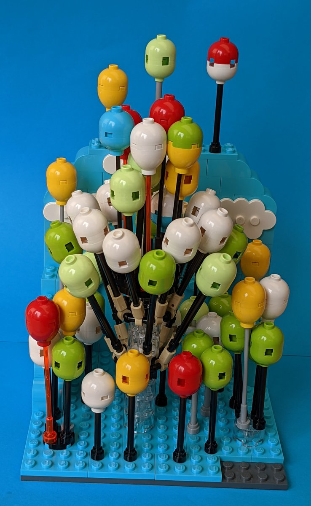
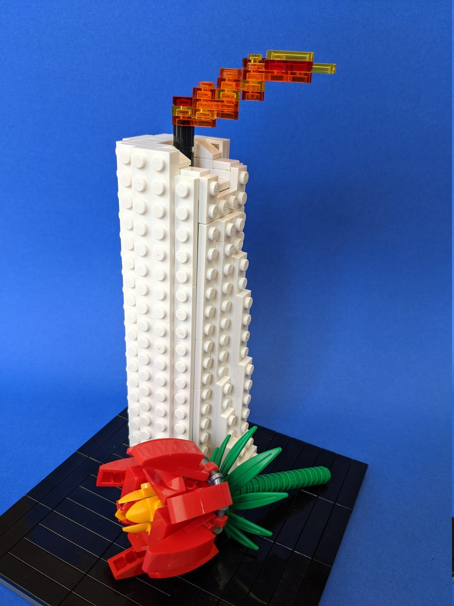
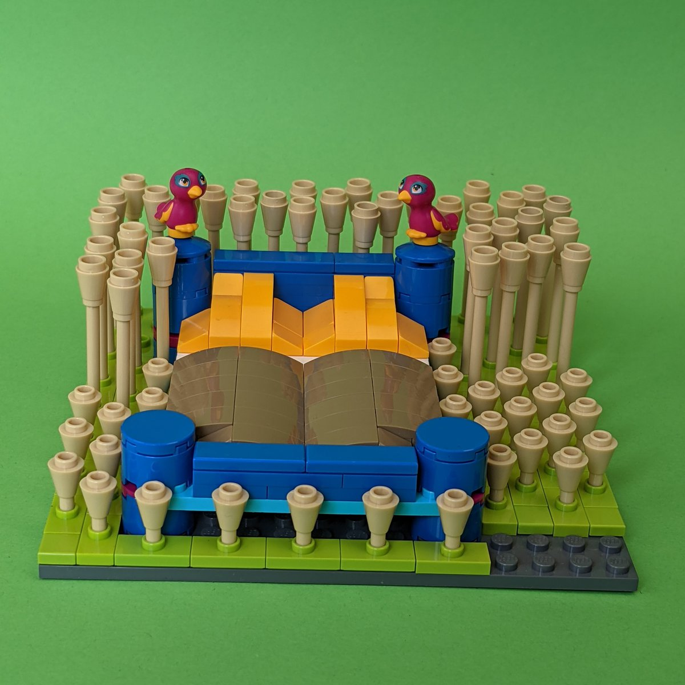
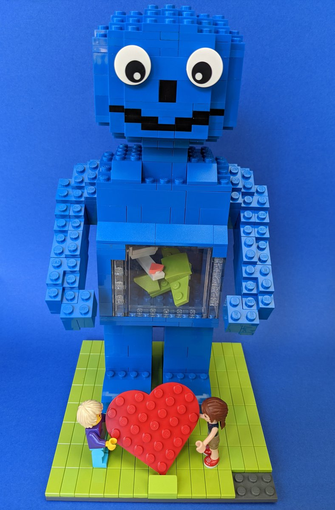
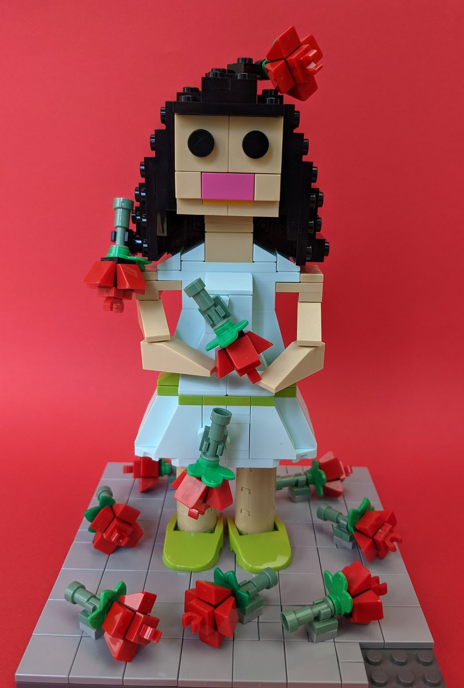
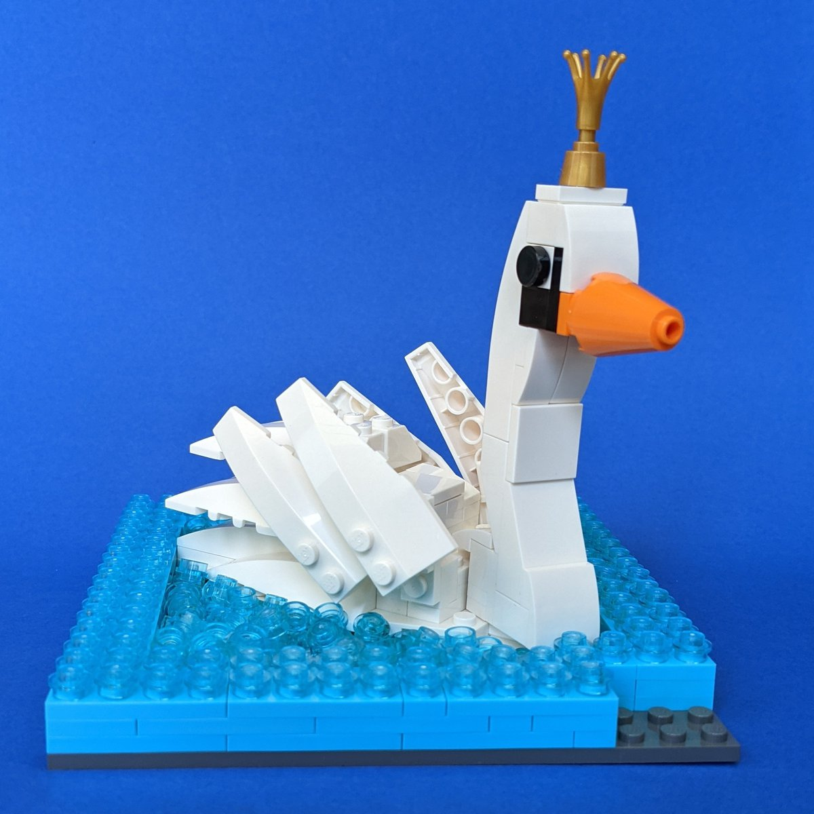

Für einen Bauwettbewerb beim SteineWAHN! 2021 hat meine Mutter folgende kleinen Modelle gebaut. Sie stellen jeweils ein bekanntes Lied dar.

## 1. Rätsel


99 Luftballons | Nena


## 2. Rätsel


Candle in the Wind | Elton John


## 3. Rätsel


Ein Bett im Kornfeld | Jürgen Drews


## 4. Rätsel


Flugzeuge im Bauch | Herbert Grönemeyer


## 5. Rätsel


Für dich soll's rote Rosen regnen | Hildegard Knef


## 6. Rätsel


Schwanenkönig | Karat
