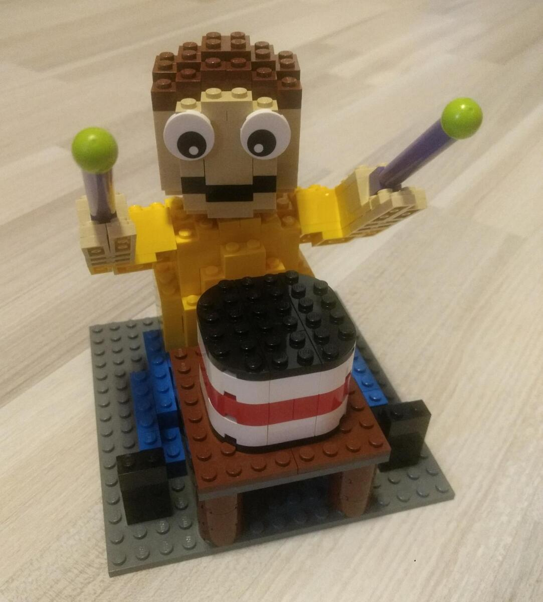
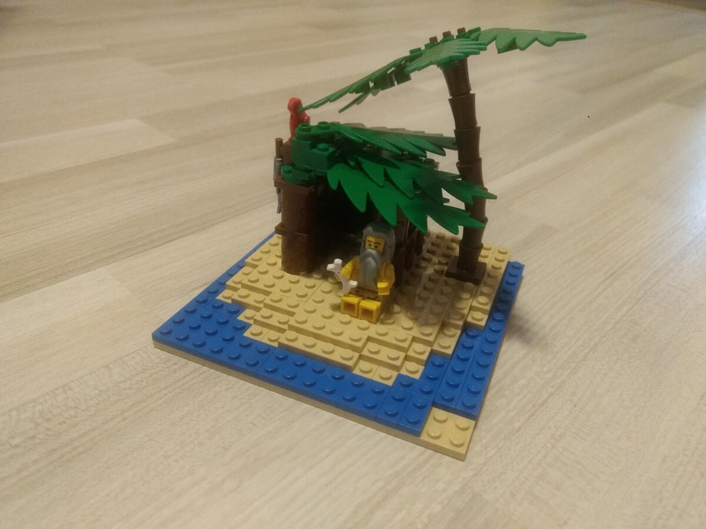
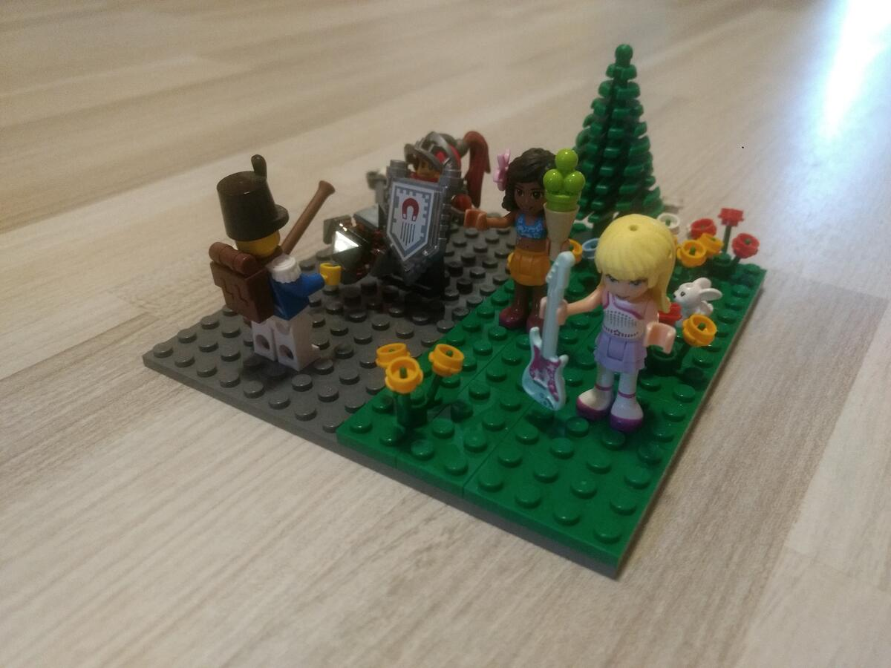
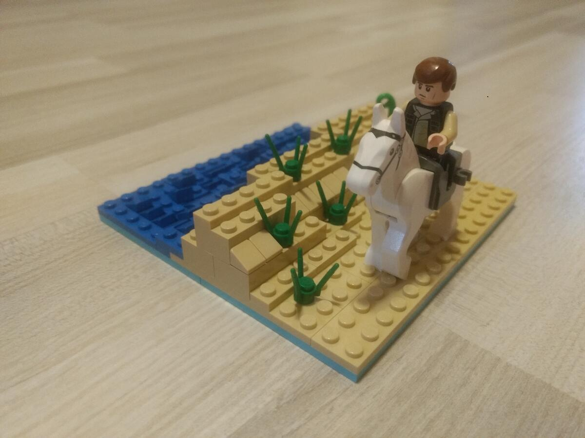
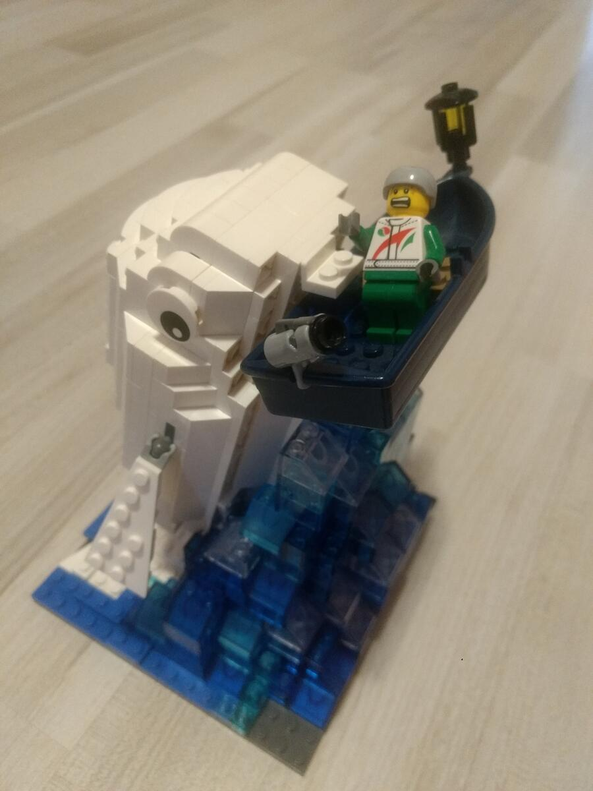
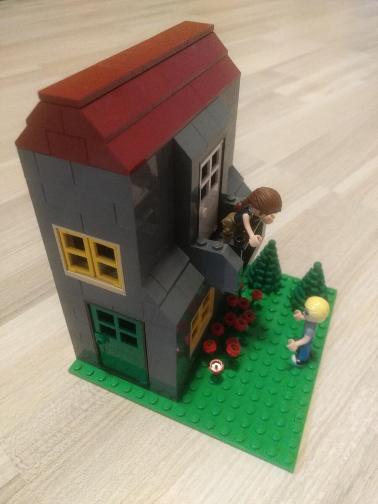
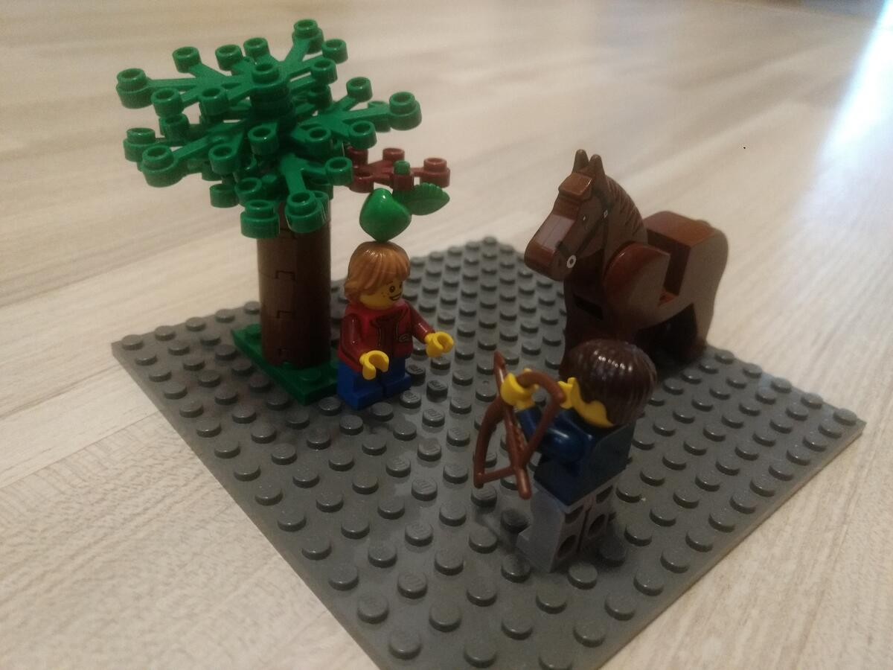

Für einen Bauwettbewerb beim [SteineWAHN!](https://steinewahn.de) hat meine Mutter Miniaturen von bekannten literarischen Werken gebaut. Viel Spaß beim Raten.

## 1. Rätsel


Die Blechtrommel | Günter Grass


## 2. Rätsel


Robinson Crusoe | Daniel Defoe


## 3. Rätsel


Krieg und Frieden | Lew Tolstois


## 4. Rätsel


Der Schimmelreiter | Theodor Storm


## 5. Rätsel


Moby-Dick | Herman Melville


## 6. Rätsel


Romeo und Julia | William Shakespeare


## 7. Rätsel


Wilhelm Tell | Friedrich Schiller
