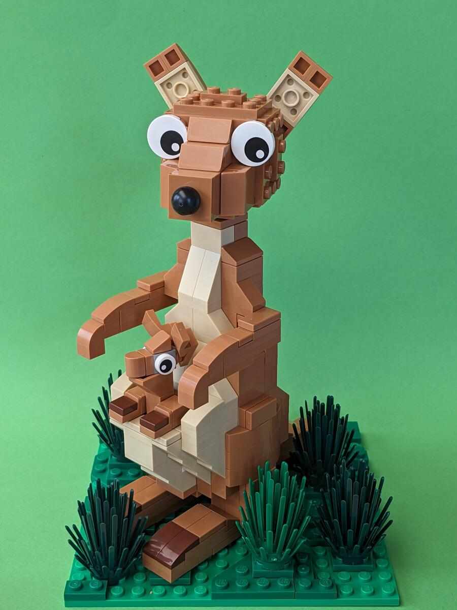
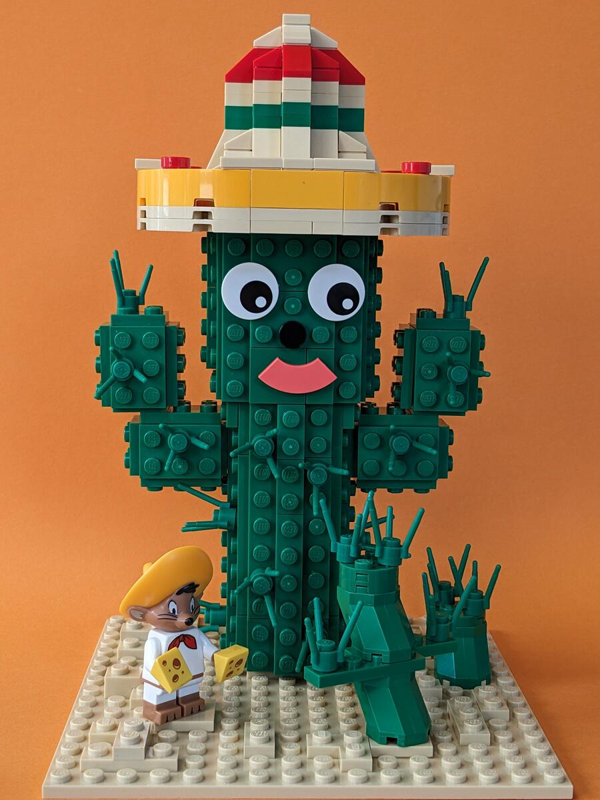
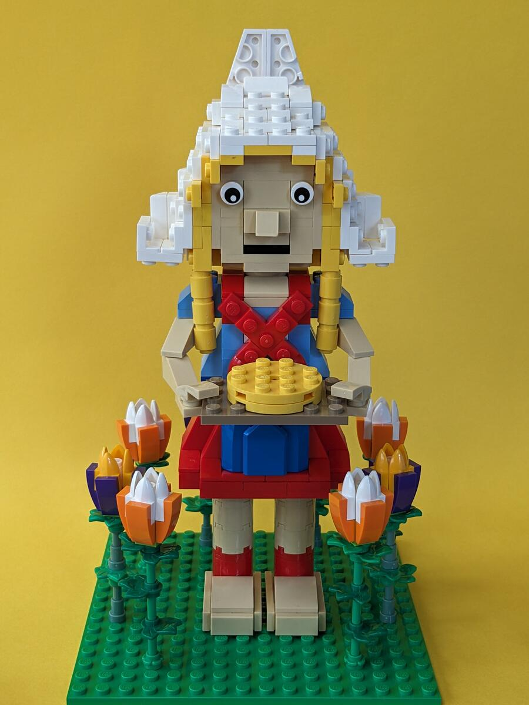
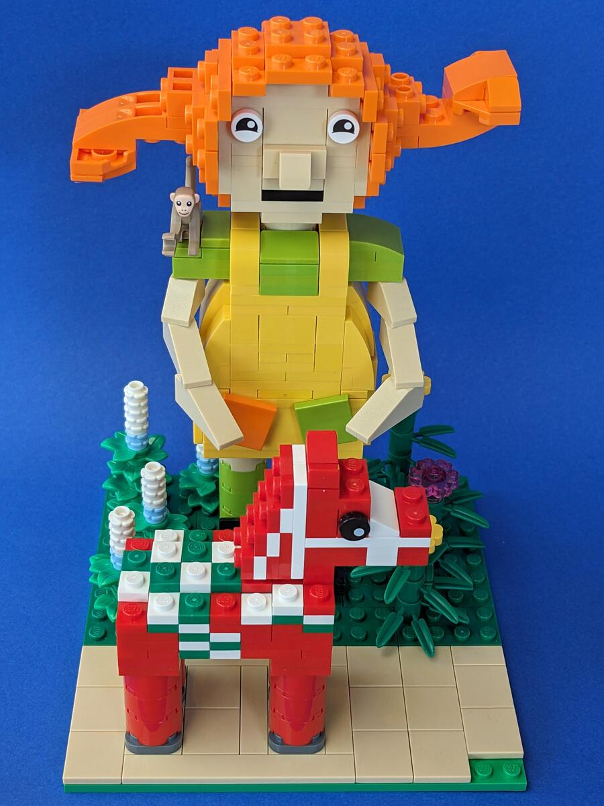
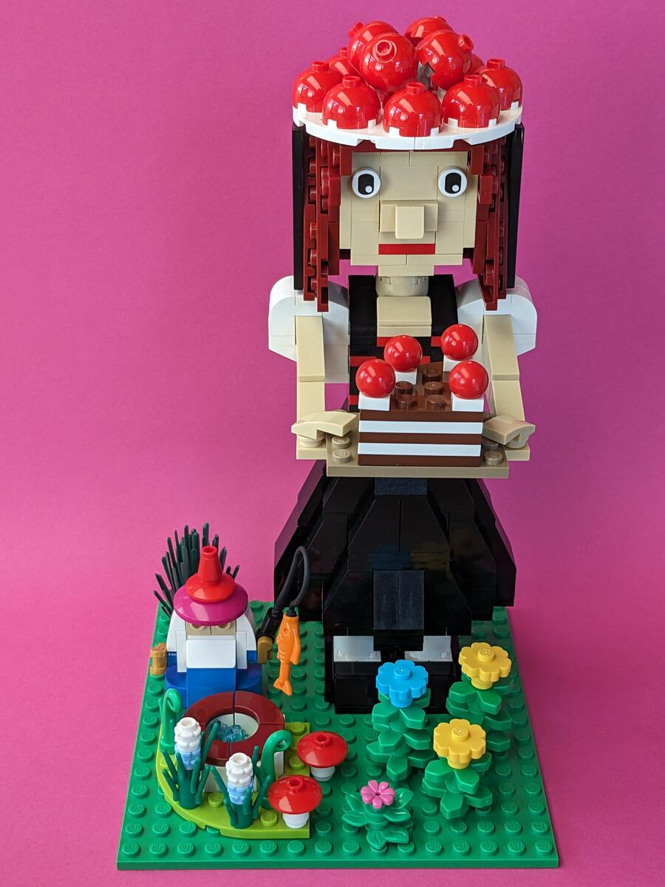
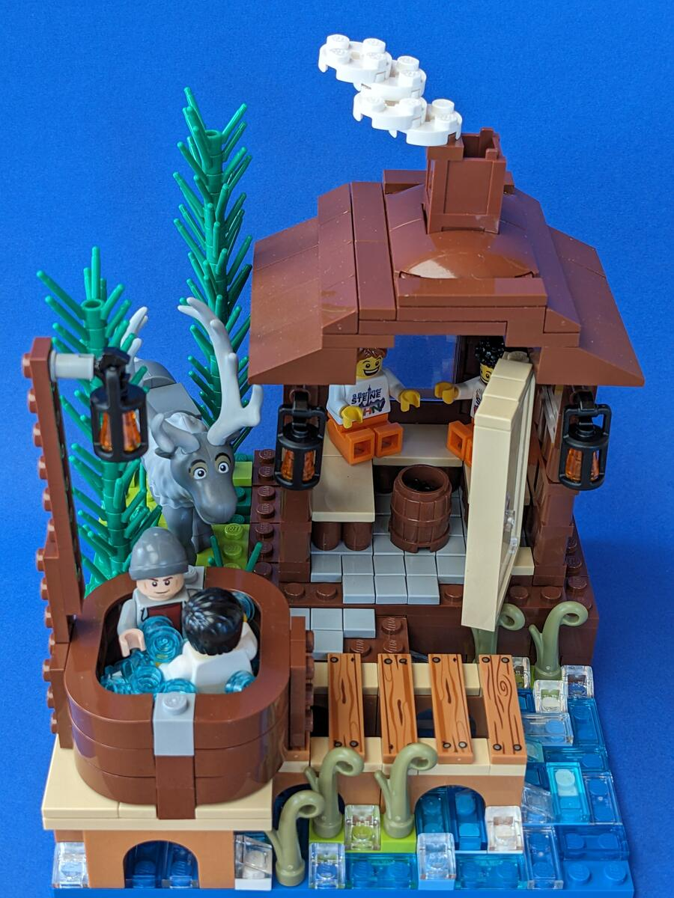
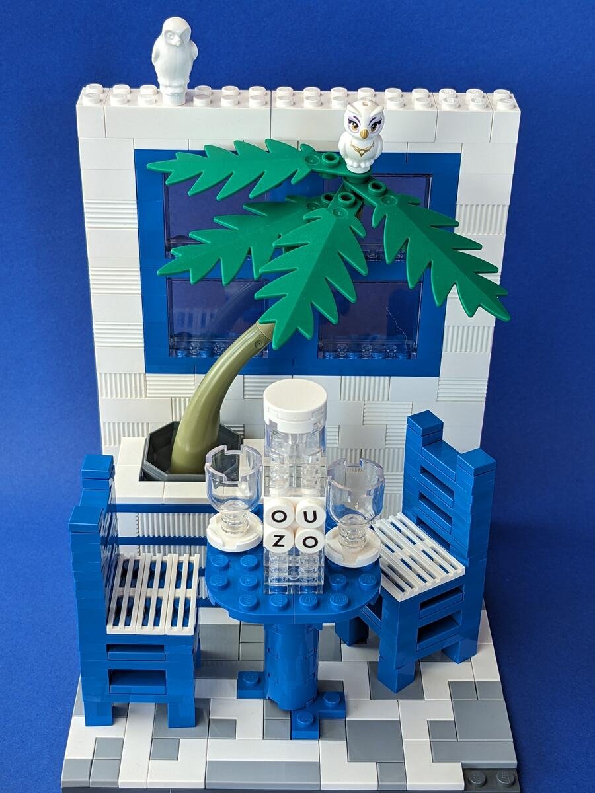

Eine weitere Bauaktion, dieses Mal auf dem 12. Berliner [SteineWAHN!](https://steinewahn.de). Dieses Mal mussten Länder auf einer 16x16-Platte dargestellt und durch die Besucher erraten werden. Viel Spaß beim Erraten der dargestellten Länder.

## 1. Rätsel


Australien


## 2. Rätsel


Mexiko


## 3. Rätsel


Schweiz


## 4. Rätsel


Die Niederlande


## 5. Rätsel


Schweden


## 6. Rätsel


Deutschland


## 7. Rätsel


Finnland


## 8. Rätsel


Griechenland


## 9. Rätsel


Spanien
