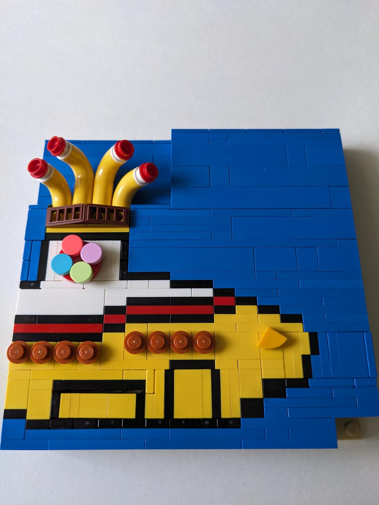
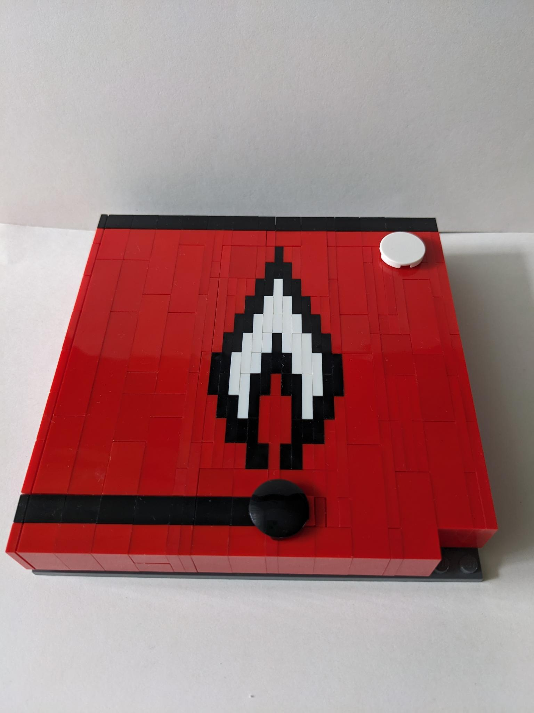
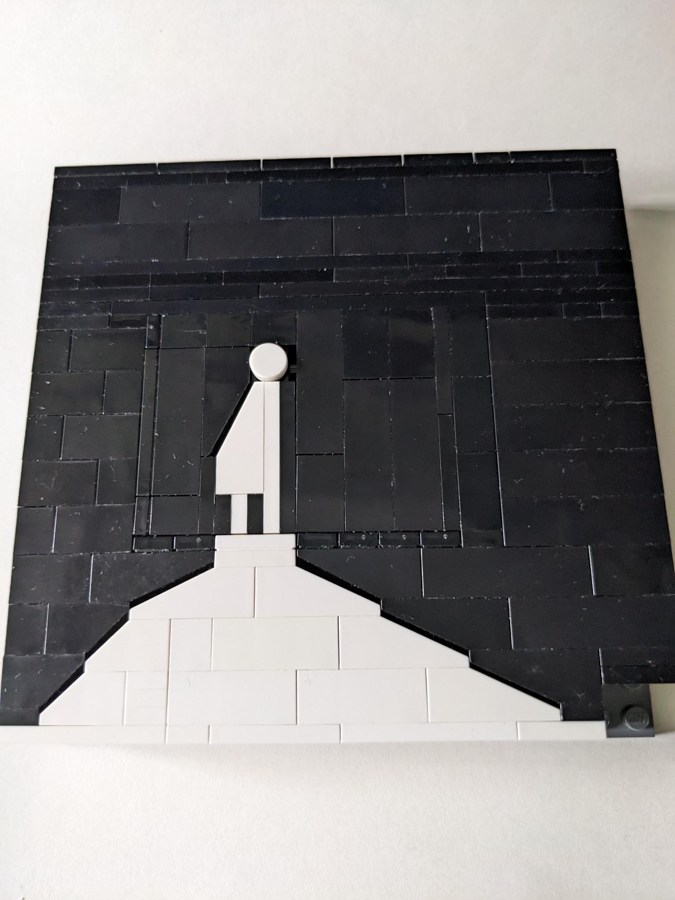
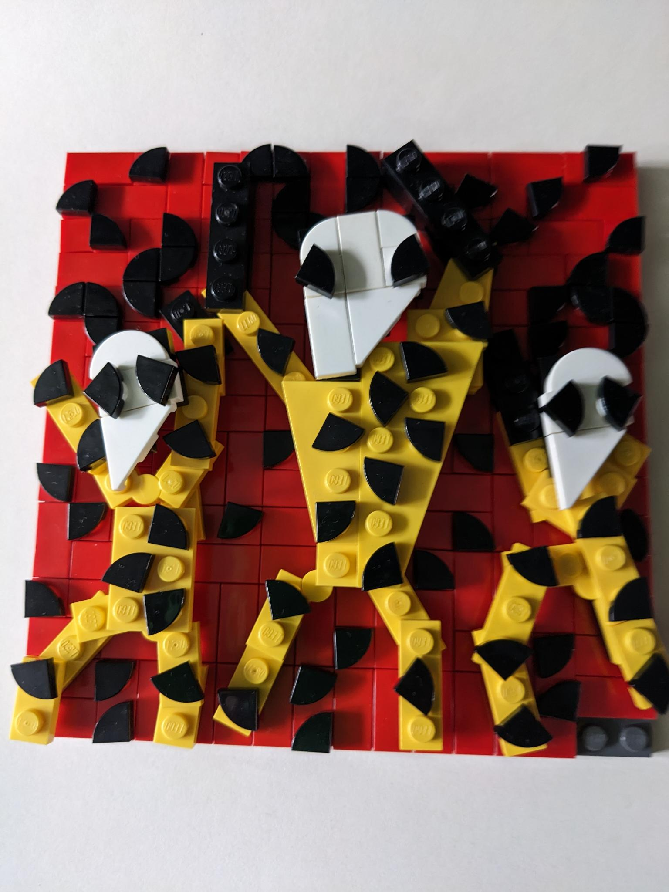
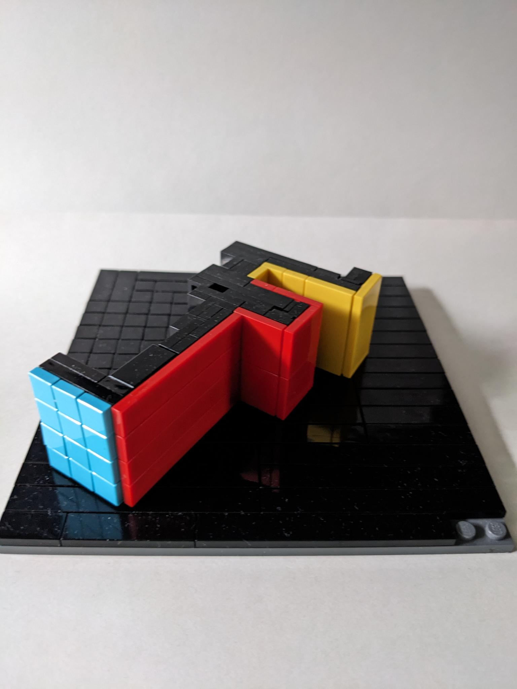
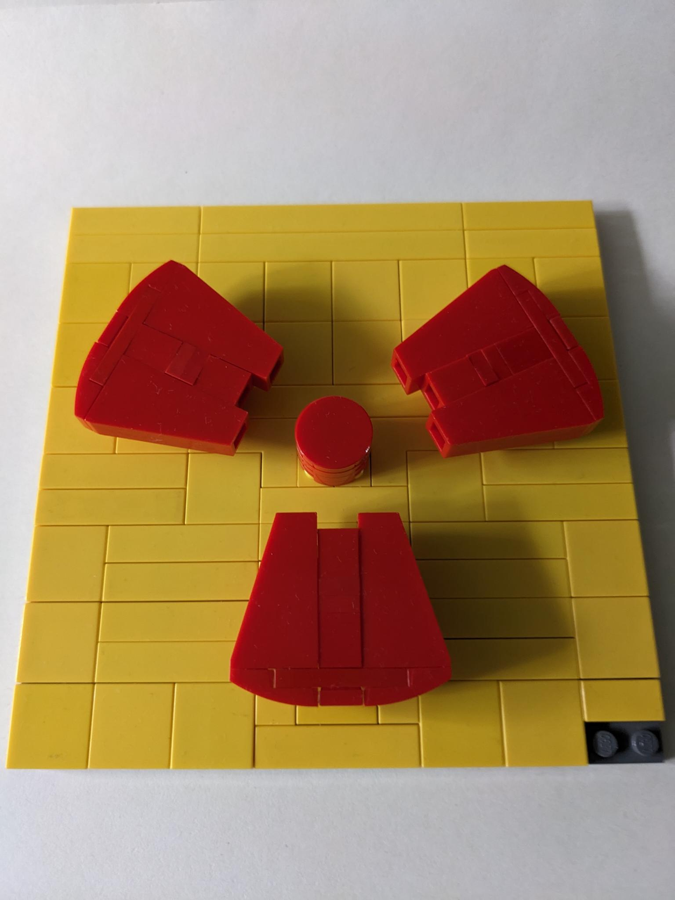
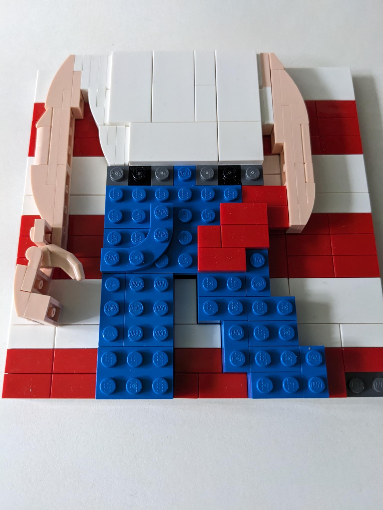
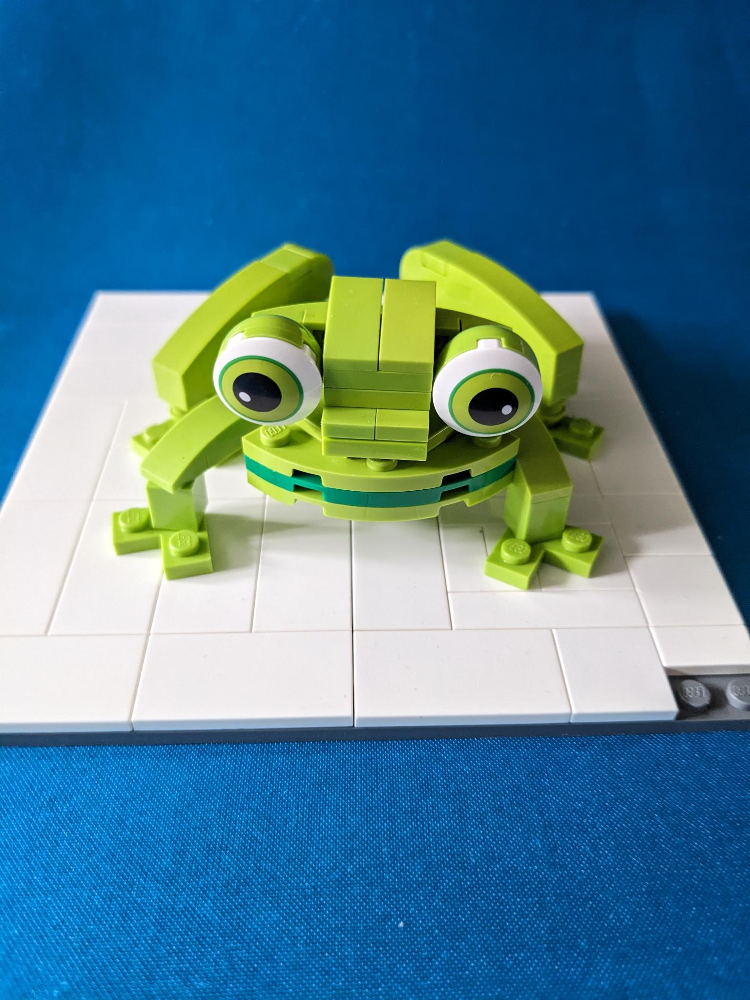
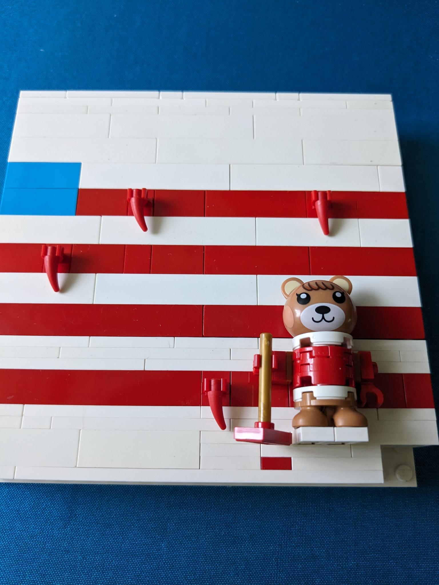
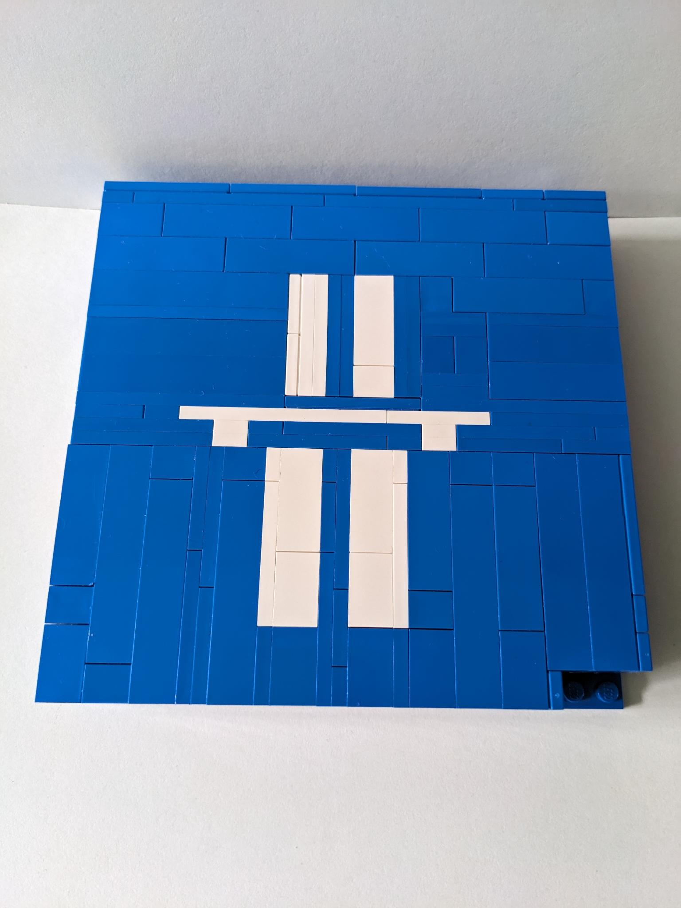

Für den 13. Berliner SteineWAHN! gab es folgende Bauaktion: Baue ein bekanntes Plattencover auf einer Fläche von 16x16 Noppen nach. Viel Spaß beim Raten.

## 1. Rätsel


The Beatles: Yellow Submarine


## 2. Rätsel


Rolling Stones: Flashpoint


## 3. Rätsel


Skunk Anansie: The Painful Truth


## 4. Rätsel


Rolling Stones: Voodoo Lounge Uncut


## 5. Rätsel


Foreigner: Agent Provacateur


## 6. Rätsel


Kraftwerk: Radio-Activity


## 7. Rätsel


Bruce Springsteen: Born in the U.S.A.


## 8. Rätsel


Silverchair: frogstomp


## 9. Rätsel


Bruce Springsteen: Rockabye Baby


## 10. Rätsel


Kraftwerk: Autobahn
